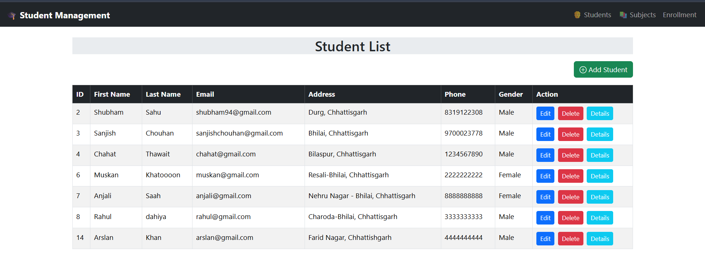
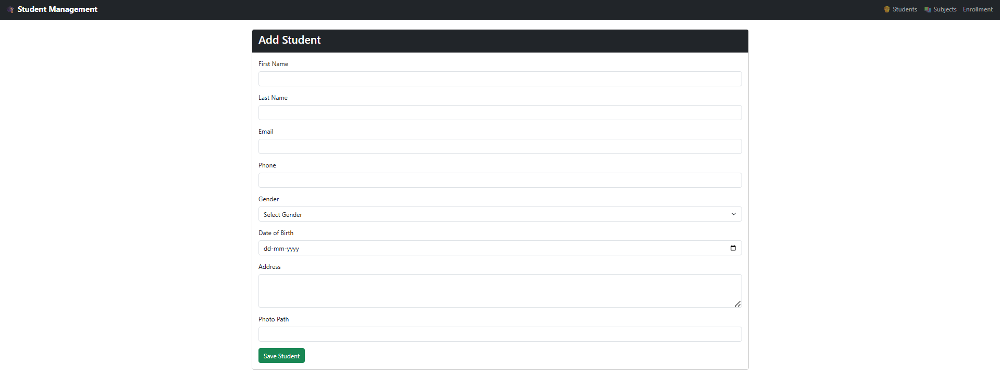
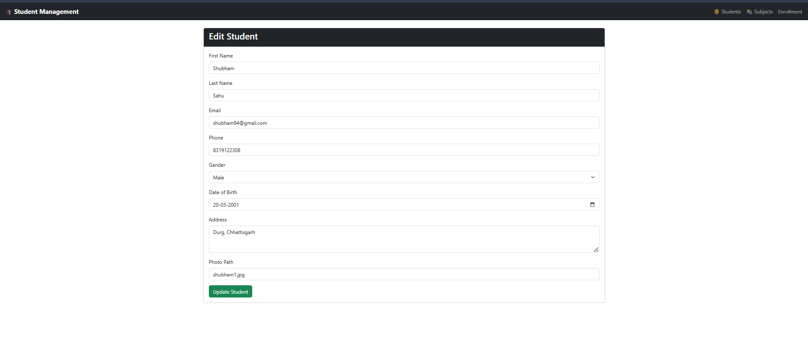
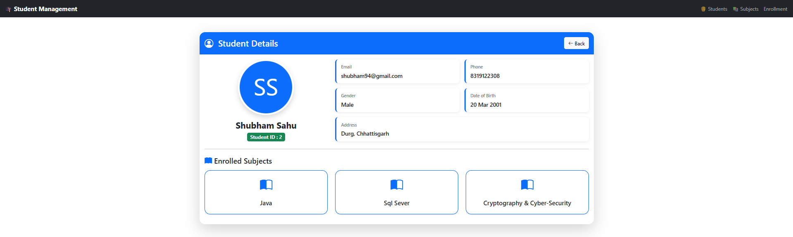
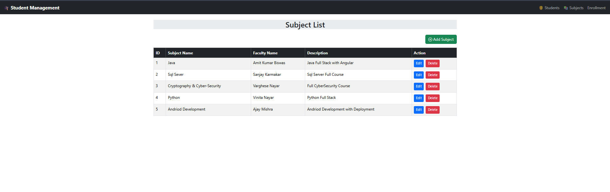
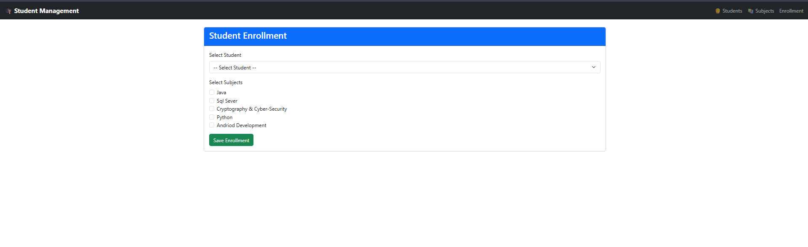

# 🎓 Student Management System

A full-stack **Student Management System** built using **ASP.NET Core Web API**, **Angular 21**, **Entity Framework Core**, and **SQL Server**.

The application allows administrators to manage student records, subjects, and enrollments through a responsive web interface backed by RESTful APIs. It follows a clean architecture using the Repository Pattern, Service Layer, Dependency Injection, and DTOs to ensure maintainability and scalability.

---

## 🚀 Features

### 👨‍🎓 Student Management
- Add Student
- Update Student
- Delete Student
- View Student List
- View Student Details

### 📚 Subject Management
- Add Subject
- Update Subject
- Delete Subject
- View Subject List

### 📝 Enrollment Management
- Enroll students in multiple subjects
- View Enrollment List
- Display enrolled subjects in Student Details

---

# 🛠️ Tech Stack

## Backend
- ASP.NET Core Web API (.NET 8)
- C#
- Entity Framework Core
- SQL Server

## Frontend
- Angular 21
- TypeScript
- HTML5
- CSS3
- Bootstrap 5
- Angular Reactive Forms

## Development Tools
- Visual Studio 2022
- Visual Studio Code
- Swagger (OpenAPI)
- Git & GitHub

---

# 📂 Project Structure

```
StudentManagementProject_DevNest
│
├── StudentManagement.API
│   ├── Controllers
│   ├── DTOs
│   ├── Interfaces
│   ├── Models
│   ├── Repositories
│   ├── Services
│   ├── Program.cs
│   └── appsettings.json
│
├── StudentManagement.UI
│   ├── src
│   │   ├── app
│   │   │   ├── components
│   │   │   ├── models
│   │   │   ├── services
│   │   │   ├── app.routes.ts
│   │   │   └── app.config.ts
│   │   └── main.ts
│
├── README.md
└── .gitignore
```
---

# 🗄️ Database Design

The application uses **SQL Server** as the database with Entity Framework Core.

### Database Tables

### Students
- StudentId (Primary Key)
- FirstName
- LastName
- Email
- Phone
- Gender
- DOB
- Address

### Subjects
- SubjectId (Primary Key)
- SubjectName

### StudentSubjects (Junction Table)
- StudentId (Foreign Key)
- SubjectId (Foreign Key)

This junction table enables a **Many-to-Many** relationship where one student can enroll in multiple subjects and one subject can have multiple students.

---

# 🌐 REST API Endpoints

## 👨‍🎓 Student APIs

| Method | Endpoint | Description |
|--------|----------|-------------|
| GET | `/api/Students` | Get all students |
| GET | `/api/Students/{id}` | Get student by ID |
| POST | `/api/Students` | Add a new student |
| PUT | `/api/Students/{id}` | Update student |
| DELETE | `/api/Students/{id}` | Delete student |

---

## 📚 Subject APIs

| Method | Endpoint | Description |
|--------|----------|-------------|
| GET | `/api/Subjects` | Get all subjects |
| GET | `/api/Subjects/{id}` | Get subject by ID |
| POST | `/api/Subjects` | Add a new subject |
| PUT | `/api/Subjects/{id}` | Update subject |
| DELETE | `/api/Subjects/{id}` | Delete subject |

---

## 📝 Enrollment APIs

| Method | Endpoint | Description |
|--------|----------|-------------|
| POST | `/api/StudentSubject/enroll` | Enroll a student in multiple subjects |
| GET | `/api/StudentSubject/enrollments` | Get all enrollments |
| GET | `/api/StudentSubject/student-details/{id}` | Get student details with enrolled subjects |


---

# ⚙️ Getting Started

## Prerequisites

Before running the project, make sure you have the following installed:

- .NET 8 SDK
- Node.js (v22 or later)
- Angular CLI
- SQL Server
- Visual Studio 2022 / VS Code

---

## Clone the Repository

```bash
git clone https://github.com/<your-github-username>/StudentManagementProject_DevNest.git
```

```bash
cd StudentManagementProject_DevNest
```

---

# Backend Setup

Navigate to the API project:

```bash
cd StudentManagement.API
```

Restore packages:

```bash
dotnet restore
```

Update the database connection string in:

```
appsettings.json
```

Apply migrations:

```bash
dotnet ef database update
```

Run the API:

```bash
dotnet run
```

Swagger will be available at:

```
https://localhost:7250/swagger
```

---

# Frontend Setup

Open another terminal.

Navigate to the Angular project:

```bash
cd StudentManagement.UI
```

Install dependencies:

```bash
npm install
```

Run the Angular application:

```bash
ng serve
```

Open your browser:

```
http://localhost:4200
```
---

# 📸 Application Screenshots

## Dashboard / Student List



---

## Add Student



---

## Edit Student



---

## Student Details



---

## Subject List



---

## Enrollment



---

# 🏗️ Architecture

The project follows a layered architecture to maintain separation of concerns and improve maintainability.

```
Presentation Layer (Angular 21)
        │
        ▼
ASP.NET Core Web API
        │
        ▼
Service Layer
        │
        ▼
Repository Layer
        │
        ▼
Entity Framework Core
        │
        ▼
SQL Server Database
```

---

# 📚 Key Learnings

Through this project, I gained hands-on experience with:

- ASP.NET Core Web API
- Angular 21 Standalone Components
- Entity Framework Core
- SQL Server
- Repository Pattern
- Service Layer
- Dependency Injection
- DTOs and AutoMapper
- RESTful API Development
- CRUD Operations
- Many-to-Many Relationships
- Angular Reactive Forms
- Bootstrap 5
- Git & GitHub

---

# 🚀 Future Enhancements

- Authentication & Authorization using JWT
- Role-Based Access Control (Admin/User)
- Search & Filtering
- Pagination
- Dashboard Analytics
- Student Photo Upload
- Export Data to Excel/PDF
- Email Notifications

---

# 👨‍💻 Author

**Shubham Sahu**

📧 Email: sahushubham940@gmail.com

💼 LinkedIn: https://www.linkedin.com/in/shubham-sahu2001/

💻 GitHub: https://github.com/Shubhamsahu2001

---

# 📄 License

This project is developed for learning purposes and portfolio demonstration.